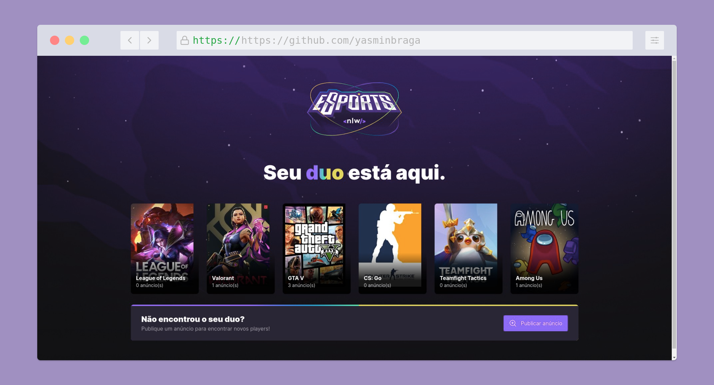
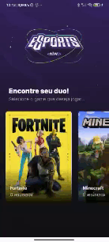

# NLW#eSports

Projeto construído na NLW especial eSports, onde foi desenvolvida uma aplicação que conecta pessoas para jogar juntos seus jogos favoritos.

## Contéudos

- [Overview](#overview)
  - [O projeto](#o-projeto)
    - [Backend](#backend)
    - [Frontend](#frontend)
    - [Mobile](#mobile)
- [Sobre mim](#sobre-mim)

## Overview

### O projeto

### Backend

O backend foi construído com NodeJs, utilizando o framework express. O banco de dados utilizado foi o SQLite e para o manuseio do banco de dados foi utilizado o Prisma ORM.

#### Instalação e execução

Após dar um clone no repositório para instalar execute

### Frontend

A contrução do frontend web da aplicação foi construída com ReactJs, utilizando o ViteJs como ambiente de desenvolvimento. Para a estilização foi utilizando Tailwindcss e Radix para a construção de componentes.

### Mobile

O mobile foi construído com ReactNative e a plataforma Expo.

## Sobre mim

- Meu perfil na Rocketseat - [Yasmin Braga](https://app.rocketseat.com.br/me/yasmin-braga-1568974763)
- Frontend Mentor - [@yasminbraga](https://www.frontendmentor.io/profile/yasminbraga)
- Instagram - [@yasminbragat](https://www.twitter.com/yasminbragat)
- Twitter - [@minbragat](https://www.twitter.com/minbragat)

Made with :heart: by [Yasmin Braga](https://github.com/yasminbraga)
